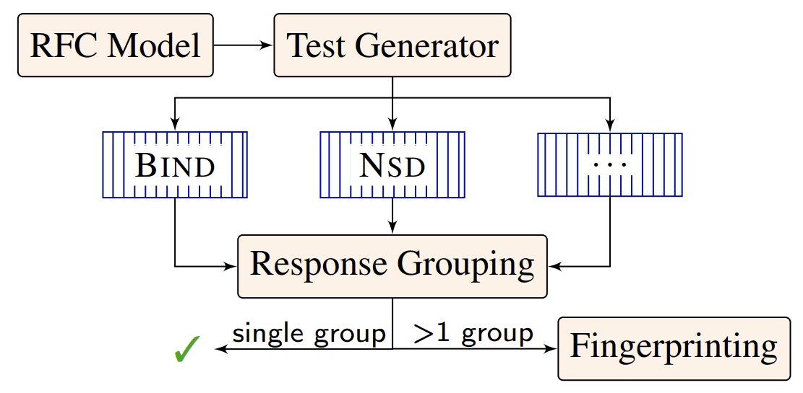

Ferret 
==========

[](https://opensource.org/licenses/MIT)
[](https://app.codecov.io/gh/dns-groot/ferret)

Ferret is the first automatic test generator for DNS nameserver implementation RFC compliance. 

<p align="center">
  
  <br>
</p>


The [test case generation](TestGenerator/) module is implemented in C# and symbolically executes the [Zen](https://github.com/microsoft/Zen) model of the authoritative DNS, which is based on our [updated DNS formal semantics.](https://sivakesava1.github.io/assets/pdf/sigcomm20_groot.pdf) The formal semantics were part of the earlier [SIGCOMM paper](https://dl.acm.org/doi/10.1145/3387514.3405871) we published. The [testing](DifferentialTesting/) module uses [Docker](https://www.docker.com/) to test implementations.

Follow the steps mentioned in test case generation [README](TestGenerator/) to generate tests using Zen. Use either the Zen generated tests or custom tests to test implementations by following the steps mentioned in DifferentialTesting [README](DifferentialTesting/). To simply serve a zone using an implementation docker container follow these [steps](DifferentialTesting/Implementations).


:page_with_curl: [NSDI 2022](https://www.usenix.org/conference/nsdi22) -- [SCALE: Automatically Finding RFC Compliance Bugs in DNS Nameservers](https://www.usenix.org/conference/nsdi22/presentation/kakarla)

:desktop_computer: [Slides and Talk](https://www.sivak.dev/projects/8-ferret)

## Citing Ferret

```
@inproceedings {278336,
author = {Siva Kesava Reddy Kakarla and Ryan Beckett and Todd Millstein and George Varghese},
title = {{SCALE}: Automatically Finding {RFC} Compliance Bugs in {DNS} Nameservers},
booktitle = {19th USENIX Symposium on Networked Systems Design and Implementation (NSDI 22)},
year = {2022},
isbn = {978-1-939133-27-4},
address = {Renton, WA},
pages = {307--323},
url = {https://www.usenix.org/conference/nsdi22/presentation/kakarla},
publisher = {USENIX Association},
month = apr,
}
```

## Bugs Found

Legend - Fixed: ✅&nbsp;&nbsp;&nbsp;&nbsp;Confirmed: ☑️&nbsp;&nbsp;&nbsp;&nbsp;Bug but not fixing it: :warning: 

<table>
    <thead>
        <tr>
            <th align='center'>Implementation</th>
            <th align='center'>Bug</th>
            <th align='center'>Bug Type</th>
            <th align='center'>Status</th>
        </tr>
    </thead>
    <tbody>
        <tr>
           <th rowspan=4 align='center'><a href='https://gitlab.isc.org/isc-projects/bind9'>Bind</a></th>
           <td><a href='https://gitlab.isc.org/isc-projects/bind9/-/issues/2384'>Sibling glue records not returned</a> </td>
           <td align='left'>Wrong Additional</td>
           <td align='center'>☑️</td>
        </tr>
        <tr>
           <td><a href='https://gitlab.isc.org/isc-projects/bind9/-/issues/2385'>Zone origin glue records not returned</a></td>
           <td align='left'>Wrong Additional</td>
           <td align='center'>☑️</td>
        </tr>
        <tr>
           <td><a href='https://gitlab.isc.org/isc-projects/bind9/-/issues/2284'>Synthesized <code>CNAME</code> is not taken for  a <code>CNAME</code> query</a> </td>
           <td align='left'>Wrong <code>RCODE</code></td>
           <td align='center'>✅</td>
        </tr>
        <tr>
           <td><a href='https://gitlab.isc.org/isc-projects/bind9/-/issues/2540'><code>DNAME</code> recursion denial-of-service</a> </td>
           <td align='left'><b>Server Crash</b></td>
           <td align='center'>✅</td>
        </tr>
        <tr>
           <th rowspan=4 align='center'><a href='https://github.com/NLnetLabs/nsd'>Nsd</a></th>
           <td><a href='https://github.com/NLnetLabs/nsd/issues/151'><code>DNAME</code> not applied recursively</a></td>
           <td align='left'>Wrong Answer</td>
           <td align='center'>✅</td>
        </tr>
        <tr>
           <td><a href='https://github.com/NLnetLabs/nsd/issues/152'>Wrong <code>RCODE</code> when <code>*</code> is in rdata</a></td>
           <td >Wrong <code>RCODE</code></td>
           <td align='center'>✅</td>
        </tr>
        <tr>
           <td><a href='https://github.com/NLnetLabs/nsd/issues/140'>Synthesized <code>CNAME</code> is not taken for  a <code>CNAME</code> query</a> </td>
           <td align='left'>Wrong <code>RCODE</code></td>
           <td align='center'>✅</td>
        </tr>
        <tr>
           <td><a href='https://github.com/NLnetLabs/nsd/issues/174'>Used <code>NS</code> records below delegation</a> </td>
           <td align='left'>Wrong Answer</td>
           <td align='center'>✅</td>
        </tr>
        <tr>
           <th rowspan=2 align='center'><a href='https://github.com/PowerDNS/pdns'>PowerDns</a></th>
           <td><a href='https://github.com/PowerDNS/pdns/issues/9886'><code>CNAME</code> followed when not required</a></td>
           <td >Wrong Answer</td>
           <td align='center'>☑️</td>
        </tr>
        <tr>
           <td><a href='https://github.com/PowerDNS/pdns/issues/9734'><code>DNAME</code> at apex pdnsutil check-zone</a> </td>
           <td align='left'>Wrong Answer</td>
           <td align='center'>✅</td>
        </tr>
        <tr>
           <th rowspan=5 align='center'><a href='https://gitlab.nic.cz/knot/knot-dns'>Knot</a></th>
           <td><a href='https://gitlab.nic.cz/knot/knot-dns/-/issues/715'>Incorrect record synthesis</a></td>
           <td align='left'>Wrong Answer</td>
           <td align='center'>✅</td>
        </tr>
        <tr>
           <td><a href='https://gitlab.nic.cz/knot/knot-dns/-/issues/714'><code>DNAME</code> not applied recursively</a></td>
           <td align='left'>Wrong Answer</td>
           <td align='center'>✅</td>
        </tr>
        <tr>
           <td><a href='https://gitlab.nic.cz/knot/knot-dns/-/issues/713'>Used records below delegation</a></td>
           <td align='left'>Wrong Answer</td>
           <td align='center'>✅</td>
        </tr>
        <tr>
           <td><a href='https://gitlab.nic.cz/knot/knot-dns/-/issues/703'>Error in <code>DNAME</code>-<code>DNAME</code> loop Knot test</a></td>
           <td align='left'>Faulty Knot Test</td>
           <td align='center'>✅</td>
        </tr>
        <tr>
           <td><a href='https://gitlab.nic.cz/knot/knot-dns/-/merge_requests/1217'>Synthesized <code>CNAME</code> is not taken for  a <code>CNAME</code> query</a> </td>
           <td align='left'>Wrong <code>RCODE</code></td>
           <td align='center'>✅</td>
        </tr>
        <tr>
           <th rowspan=6 align='center'><a href='https://github.com/coredns/coredns'>CoreDns</a></th>
           <td><a href='https://github.com/coredns/coredns/issues/4374'><code>NXDOMAIN</code> for an existing domain</a></td>
           <td align='left'>Wrong <code>RCODE</code></td>
           <td align='center'> ⚠️ </td>
        </tr>
        <tr>
           <td><a href='https://github.com/coredns/coredns/issues/4288'>Wrong <code>RCODE</code> for <code>CNAME</code> target</a></td>
           <td align='left'>Wrong <code>RCODE</code></td>
           <td align='center'>✅</td>
        </tr>
        <tr>
           <td><a href='https://github.com/coredns/coredns/issues/4378'>Wildcard <code>CNAME</code> loops and <code>DNAME</code> loops</a></td>
           <th align='left'>Server Crash</th>
           <td align='center'>✅</td>
        </tr>
        <tr>
           <td><a href='https://github.com/coredns/coredns/issues/4341'>Wrong <code>RCODE</code> for synthesized record</a></td>
           <td align='left'>Wrong <code>RCODE</code></td>
           <td align='center'>✅</td>
        </tr>
        <tr>
           <td><a href='https://github.com/coredns/coredns/issues/4398'><code>CNAME</code> followed when not required</a></td>
           <td align='left'>Wrong Answer</td>
           <td align='center'>✅</td>
        </tr>
        <tr>
           <td><a href='https://github.com/coredns/coredns/issues/4377'>Sibling glue records not returned</a></td>
           <td align='left'>Wrong Additional</td>
           <td align='center'>☑️</td>
        </tr>
        <tr>
           <th rowspan=3 align='center'><a href='https://github.com/yadifa/yadifa'>Yadifa</a></th>
           <td><a href='https://github.com/yadifa/yadifa/issues/10'><code>CNAME</code> chains not followed</a></td>
           <td align='left'>Wrong Answer</td>
           <td align='center'>✅</td>
        </tr>
        <tr>
           <td><a href='https://github.com/yadifa/yadifa/issues/11'>Wrong <code>RCODE</code> for <code>CNAME</code> target</a></td>
           <td align='left'>Wrong <code>RCODE</code></td>
           <td align='center'>✅</td>
        </tr>
        <tr>
           <td><a href='https://github.com/yadifa/yadifa/issues/12'>Used records below delegation</a></td>
           <td align='left'>Wrong Answer</td>
           <td align='center'>✅</td>
        </tr>
        <tr>
           <th rowspan=2 align='center'><a href='https://github.com/samboy/MaraDNS'>Maradns<a href="README.md/#note_1"><sup>#</sup></a></a></th>
           <td><code>AA</code> flag set for zone cut <code>NS</code> RRs</td>
           <td align='left'>Wrong Flag</td>
           <td align='center'>:warning: </td>
        </tr>
        <tr>
           <td>Glue records returned with <code>AA</code> flag</td>
           <td align='left'>Wrong Flag</td>
           <td align='center'> ⚠️</td>
        </tr>
        <tr>
           <th rowspan=4 align='center'><a href='https://github.com/bluejekyll/trust-dns'>TrustDns<a href="README.md/#note_1"><sup>#</sup></a></a></th>
           <td><a href='https://github.com/bluejekyll/trust-dns/issues/1342'>Wildcard matches only one label</a></td>
           <td align='left'>Wrong Answer</td>
           <td align='center'>☑️</td>
        </tr>
        <tr>
           <td><a href='https://github.com/bluejekyll/trust-dns/issues/1272'>Glue records returned with <code>AA</code> flag</a></td>
           <td align='left'>Wrong Flag</td>
           <td align='center'>☑️</td>
        </tr>
        <tr>
           <td><a href='https://github.com/bluejekyll/trust-dns/issues/1273'><code>AA</code> flag set for zone cut <code>NS</code> RRs</a></td>
           <td align='left'>Wrong Flag</td>
           <td align='center'>☑️</td>
        </tr>
        <tr>
           <td><a href='https://github.com/bluejekyll/trust-dns/issues/1283'><code>CNAME</code> loop crashes the server</a></td>
           <th align='left'>Server Crash</th>
           <td align='center'>✅</td>
        </tr>
        <tr>
           <th rowspan=4 align='center'><a href='https://github.com/TechnitiumSoftware/DnsServer'>Technitium</a></th>
           <td><a href='https://github.com/TechnitiumSoftware/DnsServer/issues/747'>Wrong <code>RCODE</code> for synthesized record</a></td>
           <td align='left'>Wrong <code>RCODE</code></td>
           <td align='center'>☑️</td>
        </tr>
        <tr>
           <td><a href='https://github.com/TechnitiumSoftware/DnsServer/issues/748'>Improper handling of non-terminal wildcard</a></td>
           <td align='left'>Wrong Answer</td>
           <td align='center'>☑️</td>
        </tr>
        <tr>
           <td><a href='https://github.com/TechnitiumSoftware/DnsServer/issues/749'>Used records below delegation</a></a></td>
           <td align='left'>Wrong Answer</td>
           <td align='center'>☑️</td>
        </tr>
        <tr>
           <td><a href='https://github.com/TechnitiumSoftware/DnsServer/issues/750'>Wildcard <code>CNAME</code> not applied again</a></a></td>
           <td align='left'>Wrong Answer</td>
           <td align='center'>☑️</td>
        </tr>
    </tbody>
</table>

<a id="note_1"><sup>#</sup></a> Implementations with unreported issues due to missing or unimplemented features


