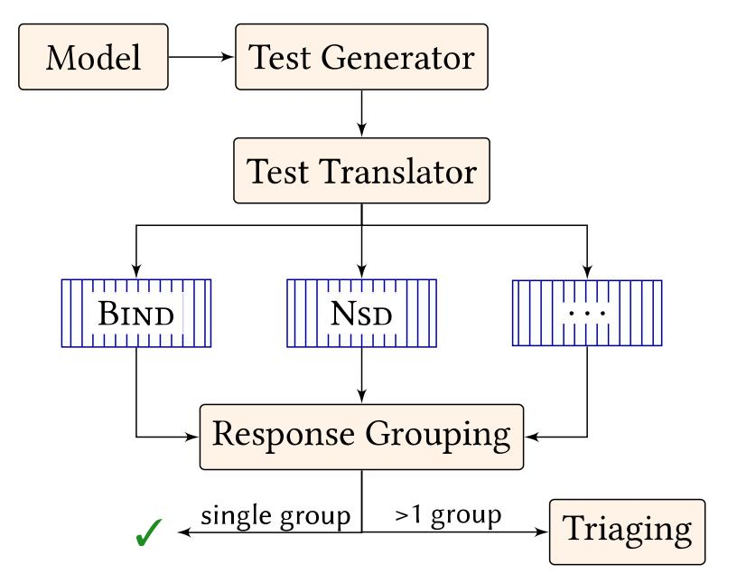

Ferret 
==========

Ferret is the first automatic test generator for DNS nameserver implementation RFC compliance. 

  
   

The [test case generation](TestGenerator/) module is implemented in C# and symbolically executes the [Zen](https://github.com/microsoft/Zen) model of the authoritative DNS, which is based on our [updated DNS formal semantics.](https://sivakesava1.github.io/assets/pdf/sigcomm20_groot.pdf) The formal semantics were part of the earlier [SIGCOMM paper](https://dl.acm.org/doi/10.1145/3387514.3405871) we published. The [testing](DifferentialTesting/) module uses [Docker](https://www.docker.com/) to test implementations.

Follow the steps mentioned in test case generation [README](TestGenerator/) to generate tests using Zen. Use either the Zen generated tests or custom tests to test implementations by following the steps mentioned in DifferentialTesting [README](DifferentialTesting/). To simply serve a zone using an implementation docker container follow these [steps](DifferentialTesting/Implementations).