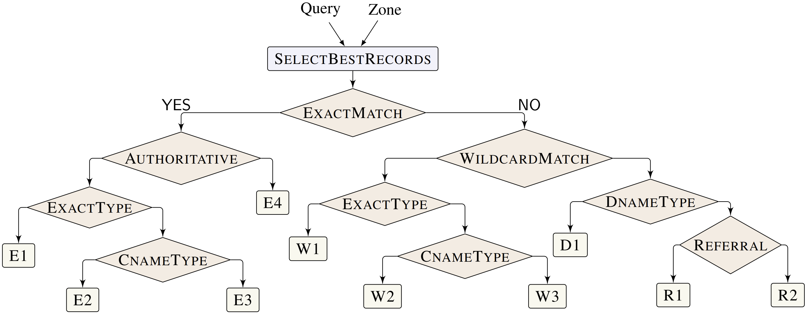

---

[**DNS Nameserver Tests -**](#dns-nameserver-tests)
&nbsp;
[Valid Zone File Tests](#valid-zone-file-tests)
&nbsp; &middot; &nbsp;
[Invalid Zone File Tests](#invalid-zone-file-tests)
&nbsp; &nbsp; &vert; &nbsp; &nbsp;
[Pre-generated Tests](#pre-generated-tests)
&nbsp; &nbsp; &vert; &nbsp; &nbsp;
[Installation](#installation)
&nbsp; &nbsp; &vert; &nbsp; &nbsp;
[Generation of Tests](#generation-of-tests)

---

## DNS Nameserver Tests
A test case in DNS consists of a query and zone file. 

### Valid Zone File Tests
Ferret generates valid tests, where each valid test consists of a valid zone file and a valid query by executing the Zen model of the authoritative semantics of DNS present in this folder, which is based on the [DNS formal semantics](https://sivakesava1.github.io/assets/pdf/sigcomm20_groot.pdf) that we developed from multiple DNS RFCs.
Our formal semantics focuses on query lookup at a single nameserver, which we model as a stateless function that takes a user query and a zone file and produces a DNS response. The figure below shows an abstract view of this function as a decision tree.
Each leaf node represents a unique case in the DNS, where a response is created and returned to the user.

<p align="center">
  
  <br>
  <span class="img_caption" style="display: block; text-align: center;"> <sub>[&thinsp;Abstract representation of the Authoritative DNS decision tree used to respond to a user query.&thinsp;]</sub></span>
  <br>
</p>

Symbolic execution of the above function (tree) generates inputs that drive the function down different execution paths, enabling Ferret to explore the space of DNS behaviors and feature interactions systematically.

### Invalid Zone File Tests
While it’s critical to be able to generate well-formed zone files for testing, bugs can also lurk in implementations' handling of ill-formed zones. 
Our executable Zen model includes a formulation of the validity conditions for zone files.

<details>
<summary><kbd>CLICK</kbd> to reveal zone validity conditions </summary>

----
||**Validity Condition**| RFC Document|
|-|---------------------|-------------|
|i.| All records should be unique (there should be no duplicates).| [2181](https://datatracker.ietf.org/doc/html/rfc2181)|
|ii.| A zone file should contain exactly one SOA record. | [1035](https://datatracker.ietf.org/doc/html/rfc1035) |
|iii.| The zone domain should be prefix to all the resource records domain name. | [1034](https://datatracker.ietf.org/doc/html/rfc1034)|
|iv.| If there is a CNAME type then no other type can exist and only one CNAME can exist for a domain name. |[1034](https://datatracker.ietf.org/doc/html/rfc1034)|
|v.| There can be only one DNAME record for a domain name.| [6672](https://datatracker.ietf.org/doc/html/rfc6672)|
|vi.| A domain name cannot have both DNAME and NS records unless there is an SOA record as well.| [6672](https://datatracker.ietf.org/doc/html/rfc6672)|
|vii.| No DNAME record domain name can be a prefix of another record’s domain name. |[6672](https://datatracker.ietf.org/doc/html/rfc6672)|
|viii.| No NS record can have a non-SOA domain name that is a prefix of another NS record. |[1034](https://datatracker.ietf.org/doc/html/rfc1034)|
|ix.| Glue records must exist for all NS records in a zone. |[1035](https://datatracker.ietf.org/doc/html/rfc1035)|
----
</details>

Ferret leverages Zen to generate zone files that violate one of these conditions systematically. The formal model shown in the earlier image is well defined only for valid zone files, and therefore, we use [GRoot](https://github.com/dns-groot/groot) to generate queries for these invalid zone files.

## Pre-generated Tests
Ferret takes in the maximum length of the domain name and the maximum number of records in the zone as an integer from the user. The tests generated for a given maximum bound is constant and do not change with each run. Therefore, we have released the tests generated for a maximum bound of 4 in a separate GitHub repository - [FerretDataset](https://github.com/dns-groot/FerretDataset). 

The dataset consists of both valid and invalid zone file tests. For valid zone files, the 12,673 tests in the [valid zone file tests](https://github.com/dns-groot/FerretDataset/tree/main/ValidZoneFileTests) folder are exhaustive _i.e.,_ there is a test for each possible path of the model for that bound. For the [invalid zone file tests](https://github.com/dns-groot/FerretDataset/tree/main/InvalidZoneFileTests), we have generated 900 ill-formed zone files, 100 violating each of the validity conditions.

**Note**: Use the tests in the [FerretDataset](https://github.com/dns-groot/FerretDataset) that were generated with the maximum bound of 4 to skip this module to save time and go directly to the [Differential testing](../DifferentialTesting/) module. For other bounds, please follow the installation and test generation steps.
## Installation  

### Native Installation
0. [Install `dotnet-sdk-5.0` for your OS.](https://docs.microsoft.com/en-us/dotnet/core/install/windows?tabs=net50)
1. Build the project using<sup>[#](#note_1)</sup> (from `TestGenerator` directory):
    ```bash
    ~/TestGenerator$ dotnet build --configuration Release
    ```
<a name="note_1"><sup>#</sup></a> Alternatively, you could open the solution in Visual Studio in Windows and build using it.

### Using `docker`

_**Note:** The docker image may consume ~&hairsp;2&hairsp;GB of disk space._

If you have trouble with native installation, then using docker is  recommend as they have negligible performance overhead.
(See [this report](http://domino.research.ibm.com/library/cyberdig.nsf/papers/0929052195DD819C85257D2300681E7B/$File/rc25482.pdf))

0. [Get `docker` for your OS](https://docs.docker.com/install).

1. Build the docker image locally (from `TestGenerator` directory): 
    ```bash
    ~/TestGenerator$ docker build -t ferrettestgen .
   ```
2. Run a container over the image using: `docker run -it --name=testgen  ferrettestgen`.<br>
   This would give you a `bash` shell within the container's `TestGenerator` directory.

## Generation of Tests  

1. If a docker container will be used for the test generation, either
    - Copy the `Results` folder from the docker container to the host system after running the tool using the following command from the **host** terminal.
        ```bash
        ~/TestGenerator$ docker cp testgen:/home/ferret/Ferret/TestGenerator/Results .
        ```
    - Or first create a `Results` folder in the host system and [bind mount](https://docs.docker.com/storage/bind-mounts) it while running the container:
        ```bash
        ~/TestGenerator$ docker run -v ${PWD}/Results:/home/ferret/Ferret/TestGenerator/Results -it --name=testgen ferrettestgen
        ```
        This would give you a `bash` shell within the container's `TestGenerator` directory.
2. Run using:
     ```bash
    ~/TestGenerator$ dotnet run --configuration Release --project Samples
    ```
    <details>
    <summary><kbd>CLICK</kbd> to show all command-line options</summary>
  
   <pre>
    -o, --outputDir    (Default: Results/) The path to the folder to output the generated tests.

    -f, --function     (Default: RRLookup) Generate tests for either <kbd>RRLookup</kbd> (1) or generate invalid zone files <kbd>InvalidZoneFiles</kbd> (2).

    -l, --length       (Default: 4) The maximum number of records in a zone and the maximum length of a domain.

    --help             Display this help screen.

    --version          Display version information. </pre>
  
    - Pass the option using `dotnet run  --configuration Release --project Samples -- -l 3`.
    - The <kbd>RRLookup</kbd> function generates valid tests which are a pair of zone and query.
    - The <kbd>InvalidZoneFiles</kbd> function generates invalid zone files by negating one validity constraint at a time while keeping the others true. For each negated constraint, the tool tries to generates 100 zone files. 

    </details>
   
3. _Est. Time:_ 
    - Ferret takes approximately 6 hours for <kbd>RRLookup</kbd> with a maximum bound of 4 to generate 12,673 tests. Each test consists of a well-formed zone file and a query that together causes execution to explore a particular RFC behavior.
    - Ferret takes approximately 2 hours for <kbd>InvalidZoneFiles</kbd> generation to generate 900 ill-formed zone files, 100 violating each of the validity conditions.
    
    <details>
    <summary><kbd>CLICK</kbd> to show the <code>Results</code> folder tree after test generation</summary>
    <pre>
    Results
    ├── ValidZoneFileTests
    │    └── ZenTests
    │        ├── 0.json
    │        ├── 1.json
    │        ├── ...
    │        └── 12673.json
    └── InvalidZoneFileTests
        ├── FalseCond_1
        │   └── ZenZoneFiles
        │       ├── 0.json
        │       ├── 1.json
        │       ├── ...
        │       └── 99.json
        ├── FalseCond_2
        │   └── ZenZoneFiles
        │       ├── 0.json
        │       ├── 1.json
        │       ├── ...
        │       └── 99.json
        ├── ...
        └── FalseCond_9
            └── ZenZoneFiles
                ├── 0.json
                ├── 1.json
                ├── ...
                └── 99.json</pre>
    </details>
    
After the tests are generated, go to the [Differential testing](../DifferentialTesting/) module.

